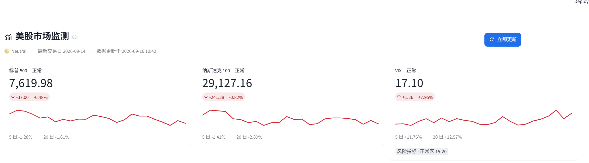
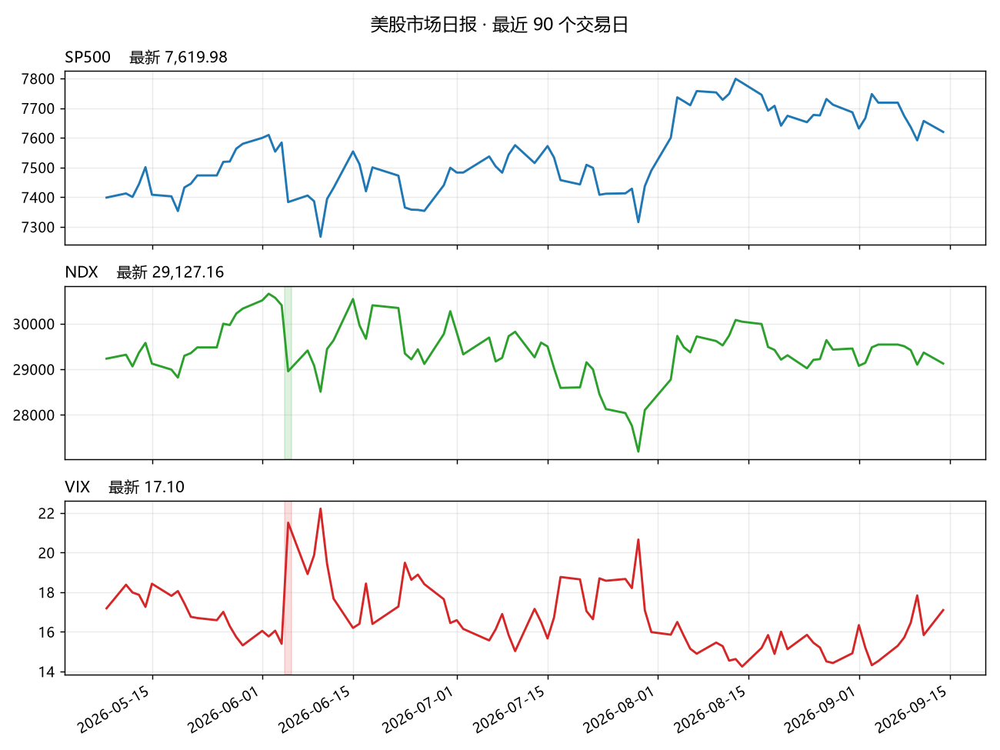

# 美股市场监测

每天回答三个问题：**S&P 500、Nasdaq 100、VIX 现在什么情况？有没有出现异常？现在算 Risk-on 还是 Risk-off？**

每个交易日收盘后自动取数 → 算指标 → 判异常 → 存历史 → 出日报，并提供一个能 **10 秒看清市场状态**的网页。数据源是 Yahoo Finance 免费接口，不需要 API key，不需要服务器——装好 Python 就能跑。



<details>
<summary>日报里自动生成的走势图（每天收盘后产出）</summary>



</details>

| 项目 | 内容 |
| --- | --- |
| 技术栈 | Python 3.13 · pandas · Streamlit · Altair · matplotlib |
| 数据源 | Yahoo Finance 日线（免费、无需 API key） |
| 监控标的 | 标普 500 · 纳斯达克 100 · VIX |
| 自动化 | Windows 任务计划程序，周二至周六 06:00（香港时间）无人值守 |
| 测试 | 72 条自动化测试，不联网、不碰真实数据；每次 push 由 GitHub Actions 自动跑 |

**这个项目的几个特点**

- **数据可靠**：取数失败会自动用本地缓存兜底，**并在报告里写明"这次数据偏旧"**；盘中会丢掉"还没收盘的今天"，避免把半根 K 线当成完整一天
- **结论可解释**：风险评分是六项加出来的，**每一分都能在界面上看到出处**，不是黑箱
- **结果可验证**：内置"信号复盘"，用历史数据回算这些信号出现之后市场到底怎么走
- **无人值守**：定时任务 + 数据自愈（本地文件丢了能自己重建 250 天历史）+ 失败不会覆盖当天已有的好报告

项目位置：`F:\codex\2026-09-14\new-chat-4\outputs\us-market-monitor`

---

## 一、它是怎么运转的

```
config.py       配置：监测什么、阈值多少、文件放哪里
    ↓
run_daily.py    总指挥：按顺序调用下面五步（自己不干活）
    ↓
src/fetch.py    上网取 S&P 500 / Nasdaq 100 / VIX 的历史日线
src/metrics.py  算涨跌幅、均线、VIX 相关指标
src/signals.py  按阈值判断：正常 / 关注 / 警报
src/history.py  把今天这一行追加进 data\history.csv（第一次运行会回填 250 天）
src/chart.py    读历史表，画成 reports\2026-09-14.png
src/report.py   写成 reports\2026-09-14.md（里面引用那张图），并打印到终端
```

一句话记住这个设计：**只有 fetch.py 会上网，只有 signals.py 负责下判断，只有 chart.py 会画图。**

这样做的好处很实际——以后数据源从 Yahoo 换成新浪，只需要改 `fetch.py`；
阈值想调松调紧，只需要改 `config.py`。其它文件都不用动。

---

## 二、目录结构

```
us-market-monitor\
├── README.md            你正在看的这份说明书
├── requirements.txt     需要安装哪些第三方库
├── requirements-dev.txt 只有开发和测试才需要的依赖（pytest）
├── pytest.ini           测试配置
├── .gitignore           告诉 Git 哪些文件不用管
├── config.py            ★ 唯一的配置开关（标的、阈值、路径）
├── run_daily.py         ★ 每天运行的入口
├── run_daily.bat        ★ 定时任务调用它（双击也能手动跑一次）
├── app.py               ★ 网页界面（streamlit run app.py）
├── run_web.bat          ★ 双击打开网页（启动本地服务）
├── .streamlit\
│   └── config.toml      网页的设计系统（配色、字号、圆角、侧栏样式）
├── src\                 业务逻辑，一个文件一层
│   ├── __init__.py      让 src 成为一个可以被 import 的包
│   ├── fetch.py         取数层：外部数据 → 内部统一格式
│   ├── metrics.py       指标层：统一格式 → 数字指标
│   ├── signals.py       判断层：数字指标 → 异常结论
│   ├── history.py       历史层：每天的结论攒成一张表（data\history.csv）
│   ├── chart.py         图表层：历史表 → reports\YYYY-MM-DD.png
│   ├── market_state.py  展示层分析：风险评分、市场状态、✓/⚠ 清单（只给网页用）
│   ├── signal_stats.py  信号复盘：这些信号出现之后市场怎么走（只给网页用）
│   └── report.py        输出层：结论 + 走势图 → Markdown 日报
├── tests\               自动化测试（72 条，不联网、不碰真实数据）
│   ├── conftest.py      公共夹具：临时目录 + 假日线数据
│   └── test_*.py        按模块拆分的测试
├── .github\
│   └── workflows\tests.yml   每次 push 自动跑测试
├── docs\                文档用图（README 里展示的截图）
├── data\                数据和历史表（CSV，不进 Git）
│   ├── .gitkeep         占位文件，让 Git 保留这个空目录
│   ├── SP500.csv 等     每天刷新的原始日线缓存
│   └── history.csv      一天一行攒下来的历史（第一次运行自动回填 250 天）
├── reports\             每天生成的日报和走势图（不进 Git）
│   ├── .gitkeep         占位文件
│   ├── YYYY-MM-DD.md    日报正文
│   └── YYYY-MM-DD.png   走势图
└── logs\                定时任务的运行日志（不进 Git）
```

---

## 三、每个文件具体是干什么的

| 文件 | 作用 | 你多久会改它一次 |
| --- | --- | --- |
| `config.py` | 所有"会变的数字"都放这：监测哪三个标的、异常阈值多少、数据存哪里。其它文件只 import，不自己写死。 | 经常（想调阈值时） |
| `run_daily.py` | 每日入口。读配置 → 取数 → 算指标 → 判异常 → 存历史 → 出报告。它自己不实现任何逻辑，只负责按顺序调用。 | 几乎不改 |
| `run_daily.bat` | 定时任务实际调用的东西：切到项目目录 → 跑 `run_daily.py` → 把输出追加到 `logs\scheduled.log`，并把退出码原样传出去。双击它也能手动跑一次。 | 几乎不改（升级 Python 版本时要改里面的路径） |
| `app.py` | Streamlit 网页（Dashboard）。读 `data\history.csv` 和 `reports\*.md` 做展示，不碰数据获取逻辑；「立即更新」按钮调用 `run_daily.main()`，复用同一条流水线。 | 想换页面布局时 |
| `src/market_state.py` | 展示层分析：把每天的行情算成风险评分（0-100）、市场状态（Risk-on / Neutral / Risk-off / Panic）和 ✓/⚠ 清单。**只被网页使用**，不写回任何文件，日报流水线完全不受影响。 | 想调风险评分的权重时 |
| `src/signal_stats.py` | 信号复盘：按"当天结论"和"风险等级"分组，统计之后 1 / 5 / 20 个交易日标普 500 的涨跌。用来检验阈值有没有意义。**只读历史表**，不写文件。 | 想换个统计口径时 |
| `.streamlit/config.toml` | 网页的设计系统：配色、字号层级、圆角、边框、侧栏样式。用 Streamlit 原生主题实现，不写自定义 CSS（CSS 会因为版本升级失效）。 | 想改配色或字号时 |
| `run_web.bat` | 双击它打开网页：启动本地服务并打开浏览器。**窗口关掉服务就停**。已经有一个服务在跑时会提示"ALREADY running"，不会重复启动。 | 几乎不改（升级 Python 版本时要改里面的路径） |
| `src/fetch.py` | **唯一会上网的文件**。负责请求数据、校验数据、整理成统一格式、存一份 CSV 缓存。 | 换数据源时 |
| `src/metrics.py` | 把"一堆日线"变成"几个关键数字"：1日/5日/20日涨跌幅、MA20/MA50、收盘价偏离均线多少、VIX 的绝对水平和单日变化。 | 想加新指标时 |
| `src/signals.py` | 项目的"大脑"。拿 `config.py` 里的阈值去比对指标，输出 `normal / watch / alert` 三档结论，并写清楚**为什么**这么判。 | 想改判断规则时 |
| `src/history.py` | 每天把每个标的的收盘价、单日涨跌、相对 MA20 偏离和结论追加进 `data\history.csv`。只做存取，一行一天，同一天重跑会覆盖。 | 想多存几个指标时 |
| `src/chart.py` | 读历史表，画成三张（标普 / 纳指 / VIX）上下排列的走势图，警报日会涂成淡色。只画图，不算数、不判断。 | 想换图的样子时 |
| `src/report.py` | 只管展示，不算数字也不做判断。把指标、结论和走势图排成一份 Markdown 日报，写入 `reports\` 并打印到终端。 | 想换报告样子时 |
| `requirements.txt` | 记录项目依赖（`pandas`、`requests`、`matplotlib`、`streamlit`）。 | 加库时 |
| `.gitignore` | 排除缓存、虚拟环境、生成的数据和报告，避免把垃圾提交进 Git。 | 几乎不改 |
| `tests\` | 72 条自动化测试。**不联网、不碰真实的 data/ 和 reports/**（会被重定向到临时目录），几秒钟跑完。每个踩过的坑都有一条对应的测试，比如"同一天只留一行""报告文件名用交易日" | 加新功能时同步加 |
| `.github\workflows\tests.yml` | GitHub Actions：每次 push 自动跑一遍测试，结果在仓库的 Actions 标签页看 | 几乎不改 |
| `requirements-dev.txt` | 只有开发和测试才要装的依赖（pytest）。部署到云端不需要。 | 加测试工具时 |
| `data\.gitkeep`、`reports\.gitkeep` | 空目录 Git 不会保存，用占位文件保住目录结构。 | 不改 |

---

## 四、层与层之间的"数据合同"

分层的关键是约定好每一层交出去的格式：上层不用关心下层怎么实现，只认格式。

**1. `fetch.py` 交给 `metrics.py` 的东西**

每个指数一个 `pandas.DataFrame`：

- 行索引：日期（`DatetimeIndex`，从旧到新排列）
- 列：`open`、`high`、`low`、`close`、`volume`

> 取数时会**丢掉"今天还没收盘"的那根日线**（美东时间 16:15 之前）。因为盘前 VIX 常常比股票指数更早更新，不丢掉的话三个标的会混着两个日期，涨跌幅也会算错（VIX 会显示成"一天涨 12%"，其实那根线还没走完）。

**2. `metrics.py` 交给 `signals.py` 的东西**

一张指标表，每个指数一行（三行：SP500 / NDX / VIX）：

| 列名 | 含义 |
| --- | --- |
| `last_date` | 最新数据的日期 |
| `trading_days` | 参与计算的有效交易日数 |
| `close` | 最新收盘价（VIX 的"水平"就是它自己的收盘价，所以不需要单独一列） |
| `change_1d` / `change_5d` / `change_20d` | 涨跌幅（%） |
| `ma20` / `ma50` | 20 日、50 日移动平均线 |
| `close_vs_ma20` | 收盘价相对 MA20 偏离多少（%） |

样本不足时这些列会是 `NaN` 而不是报错，由 `signals.py` 决定怎么处理。

**3. `signals.py` 交给 `report.py` 的东西**

```python
{
    "SP500": {
        "level": "alert",
        "reasons": [
            "单日下跌 3.40%，越过 3.0% 的警报线",
            "收盘价低于 MA20 7.00%，越过 6.0% 的警报线",
        ],
    },
    "NDX": {"level": "normal", "reasons": []},
    "VIX": {"level": "watch", "reasons": ["今天没有取到 VIX 的数据，未参与判断"]},
}
```

`level` 只有三档：`normal`（正常）、`watch`（关注）、`alert`（警报）。
`reasons` 是留给以后的你看的——判断异常时**必须**留下理由，否则你不知道它为什么报警。

两个细节：

- 阈值按标的分别设在 `config.py` 里。**某个标的没出现在某条规则的字典里，就表示这条规则对它不适用**（比如 VIX 不检查"偏离 MA20"，因为它天然就贴着均线大幅摆动）。
- 即使某个标的今天根本没取到数据，它也会出现在结果里并标成"关注"——日报要如实写出"今天缺了谁"。

**4. `report.py` 交给你**

`reports\2026-09-14.md`，以及终端上的一次打印。四段固定结构：

`整体结论` → `关键数字表` → `异常与关注` → `数据说明`

同一天重复运行会覆盖同名文件——日报本来就该"一天一份"，重跑一次就刷新一次。

---

## 五、怎么运行

用 VS Code 打开项目文件夹（菜单 `文件 → 打开文件夹`），然后在终端里敲一句：

```powershell
cd F:\codex\2026-09-14\new-chat-4\outputs\us-market-monitor
python run_daily.py
```

它会依次做五件事，最后把日报写到 `reports\` 并打印到终端：

```
[1/5] 取数 ...      取回三个指数的日线；取不到的用 data\ 里的缓存兜底
[2/5] 算指标 ...    涨跌幅、均线、相对均线偏离
[3/5] 判断异常 ...  按 config.py 里的阈值判 正常 / 关注 / 警报
[4/5] 存历史数据 ... 追加进 data\history.csv（第一次运行会先回填 250 天）
[5/5] 生成日报 ...  画走势图 + 写 reports\YYYY-MM-DD.md
```

几个你会关心的行为：

- **断网也能出报告**：某个标的取数失败时，自动用 `data\` 里上次缓存的 CSV 顶上，并在日报的"数据说明"里写明"这次用的是本地缓存、不是最新数据"。数据可以旧，但不能不告诉你。
- **一个标的都没拿到时不写文件**：直接报错退出（退出码 1），避免把当天已经生成的好报告覆盖成一份全是 `--` 的废纸。
- **同一天重复运行 = 刷新同一份报告**：一天一份，不会堆一堆文件；`data\history.csv` 里当天那一行也是覆盖，不会重复。
- **第一次运行会回填历史**：用取回来的 250 天日线，把过去每天的涨跌幅、均线和结论重新算一遍，所以第一次跑完图就有内容，不用等三个月。回填用的是**现在**的规则，含义是"按今天的标准，那天算不算异常"。
- **画图失败不影响日报**：`matplotlib` 万一出问题，程序会跳过走势图照常出报告——图是锦上添花，日报才是主产品。
- **退出码**：0 = 正常，1 = 完全没拿到数据。以后挂到定时任务上，就靠它判断当天有没有出问题。

Python 3.13.15 和依赖库已经装好，直接用 `python` 命令即可。

### 跑测试

```powershell
python -m pip install -r requirements-dev.txt
python -m pytest
```

72 条测试，两秒跑完。设计上有两条硬规矩：

1. **不联网**——所有外部请求都打桩，所以断网也能跑，不会因为 Yahoo 抽风而失败
2. **不碰真实数据**——测试会把数据目录重定向到临时文件夹，跑一百遍也不会动你的 `data\history.csv`

每个踩过的坑都留了一条对应的测试：同一天重复运行只能留一行、报告文件名必须用交易日、盘中要丢掉当天的半根 K 线、VIX 不该套用指数的阈值……这样以后改代码时，这些坑不会第二次踩进去。

推到 GitHub 后，每次 push 会自动跑一遍（见仓库的 **Actions** 标签页）。

> 想单独验证某一层，在**项目根目录**用 `-m` 方式跑：
>
> ```powershell
> python -m src.fetch      # 只看取数：三个指数的收盘价
> python -m src.metrics    # 看指标：涨跌幅、均线、相对均线偏离
> python -m src.signals    # 看判断：触发了哪条规则、整体结论是什么
> python -m src.report     # 走完整流程，生成 reports\YYYY-MM-DD.md
> ```
>
> 注意中间是 `-m src.fetch` 这种写法。如果你直接写 `python src\fetch.py`，会报
> `ModuleNotFoundError: No module named 'config'`——因为 Python 只把脚本所在目录（`src\`）
> 加进搜索路径，找不到根目录的 `config.py`。这是 Python 的导入规则，不是代码有问题。

如果终端里的中文显示成乱码，先执行一次 `chcp 65001`（切换成 UTF-8）即可。

---

## 六、定时任务（让它每天自己跑）

已经注册了一个 Windows 任务计划程序任务，名字叫 **美股市场监测-日报**：

- **运行时间**：香港时间每周二到周六早上 6:00
- **为什么是周二到周六**：美东比香港慢 12～13 小时。美股周一收盘时，香港已经是周二凌晨了，所以"香港周二早上"对应的正是"美东周一收盘之后"。这样刚好覆盖美东周一到周五五个交易日，也不会在周末重复生成同一份数据。
- **为什么是 6:00**：美东 16:00 收盘，换成香港时间夏天是凌晨 4:00、冬天是 5:00。定在 6:00 一年四季都在收盘之后，留够了数据更新的时间。
- **电脑关机怎么办**：勾选了"错过计划启动时间后尽快启动"，开机后会补跑。
- **日志**：每次运行的输出追加到 `logs\scheduled.log`。出问题先看这个文件。

常用操作（在 PowerShell 里执行）：

```powershell
# 看任务状态和下次运行时间
Get-ScheduledTask -TaskName '美股市场监测-日报' | Select-Object TaskName, State
Get-ScheduledTaskInfo -TaskName '美股市场监测-日报' | Select-Object LastRunTime, LastTaskResult, NextRunTime

# 立刻手动跑一次，不用等到早上 6 点
Start-ScheduledTask -TaskName '美股市场监测-日报'

# 暂停 / 恢复
Disable-ScheduledTask -TaskName '美股市场监测-日报'
Enable-ScheduledTask -TaskName '美股市场监测-日报'

# 不要了，删掉
Unregister-ScheduledTask -TaskName '美股市场监测-日报' -Confirm:$false
```

`LastTaskResult` 是 `0` 就代表上次跑成功了，是 `1` 就代表完全没拿到数据（多半是网络问题）。

> 报告文件名用的是**交易日**（美东收盘那天），和历史表、走势图、网页顶部的"最新交易日"都是同一个口径。所以香港时间 9 月 15 日早上 6 点生成的报告，文件名是 `2026-09-14.md`——因为它讲的是 9 月 14 日那天的收盘。同一个交易日重复运行会覆盖同名文件。

---

## 七、历史表和走势图

每天的数字会攒进 `data\history.csv`，一天一行，用 Excel 直接打开就能看。列名按 `config.py` 里的标的自动生成：

| 列 | 含义 |
| --- | --- |
| `date` | **交易日**（美东收盘那天）。注意它不是运行日期——程序在香港早上跑，运行日期会比数据日期晚一天 |
| `SP500_close` / `NDX_close` / `VIX_close` | 当天收盘价 |
| `SP500_change_1d` 等 | 当天涨跌幅（%） |
| `SP500_close_vs_ma20` 等 | 当天收盘相对 MA20 的偏离（%） |
| `SP500_level` 等 | 当天结论：`normal` / `watch` / `alert` |

走势图在 `reports\YYYY-MM-DD.png`，日报正文里会引用它。它画最近 90 个交易日，上下三张分别对应标普、纳指、VIX，**触发警报的日子会涂成淡色**，一眼就能看出什么时候出过事。

第一次运行会自动回填过去 250 个交易日，所以不用干等。

改了阈值之后，历史里的旧结论还是按老标准算的。想重算，删掉 `data\history.csv` 再跑一次就行。

### 顺便一个能直接用历史表做的校准

回填完之后，可以数一数每档结论各出现了多少天：

```powershell
python -c "from src import history; d = history.load_history(); print(d.filter(like='_level').apply(lambda c: c.value_counts().to_dict()))"
```

我跑出来的结果是：过去 250 个交易日里，标普触发过 **1 天警报、45 天关注**，纳指 **2 天警报、58 天关注**，VIX **3 天警报、23 天关注**。

这说明现在这套拍脑袋定的阈值大致靠谱：**警报很稀有**（一年几次，出来就是真事），**关注大约每周一次**（够你看一眼，又不至于天天刷屏）。反过来，如果哪天你发现某条线天天报警，那说明阈值定错了，不是市场天天异常。

---

## 八、网页界面（Streamlit）

两种打开方式，效果一样：

**方式一：双击 `run_web.bat`**（最省事）

会弹出一个黑色窗口，浏览器自动打开页面。**用的时候别关那个黑窗口**——它就是服务本身；按 Ctrl+C 或直接关掉窗口，网页就停了。

**方式二：在终端里敲命令**

```powershell
cd F:\codex\2026-09-14\new-chat-4\outputs\us-market-monitor
streamlit run app.py
```

两种方式都是"启动一个本地服务"，所以要记住三件事：

- **它不是常驻的**：关掉窗口/终端，网页就打不开了（浏览器会报 `ERR_CONNECTION_REFUSED`）。想再打开，就再双击一次 `run_web.bat`。
- **已经有一个在跑时**，双击会提示"ALREADY running"，不会重复启动。
- **定时任务不会帮你启动网页**，它只管每天写数据文件。

> 小知识：Streamlit 第一次运行会在控制台问"要不要留邮箱订阅"，然后**卡在那里等输入**，服务就起不来。我已经用一个空邮箱的配置文件（`%USERPROFILE%\.streamlit\credentials.toml`）把这个提问永久关掉了。万一换台电脑又看到 `Email:`，直接按回车就行。

### 部署到云端（让别人也能打开链接）

项目已经为云端准备好了，有两处专门的设计：

- **数据自愈**：`app.py` 启动时如果发现没有 `data\history.csv`（云端容器是空的，而且重启就清空），会自动跑一遍完整流水线，把过去 250 天重算出来。所以云端不需要你上传任何数据文件。
- **缓存**：用 `@st.cache_data(ttl="30m")` 缓存读数，避免每个访客、每次点击都重新取数。缓存的钥匙是 `data\history.csv` 的**指纹**（修改时间 + 文件大小）——文件一被改写（定时任务跑完、或你手动跑 `run_daily.bat`），页面刷新立刻就是新数据；TTL 只是保证云端没人写文件时也会定期复查。

用 Streamlit 官方的免费托管（Streamlit Community Cloud）：

1. 把项目推到 GitHub（`.gitignore` 已经排除了数据和报告，这是对的）
2. 打开 `share.streamlit.io`，用 GitHub 登录 → New app
3. Repository 选你的仓库，Branch 填 `main`，Main file path 填 `app.py`
4. 点 Deploy，等两三分钟，拿到 `https://xxx.streamlit.app` 链接

两个要知道的点：云端容器重启或你重新部署之后，数据会重新生成（约 10 秒）；免费版不活跃会自动休眠，第一个访客打开要等十几秒。

> `requirements.txt` 里的版本是**写死的**（`==` 而不是 `>=`）。这样"本地能跑"就等于"云端能跑"——否则云平台可能装到更新的版本，把页面搞崩。

页面从上到下按"每天要看的顺序"排，一屏之内就能回答"今天市场怎么样"：

| 位置 | 内容 |
| --- | --- |
| 顶部 | 标题 + 市场状态 + 最新交易日 + 数据更新时间 + 「立即更新」按钮 |
| 第二行 | 三个 KPI 卡片（标普 500 / 纳斯达克 100 / VIX）：当前值、今日涨跌额、涨跌幅、5 日、20 日、迷你走势图。VIX 额外带一个风险区间标签 |
| 第三行 | 左：**市场状态**（Risk-on / Neutral / Risk-off / Panic + 风险评分 + 评分构成）；右：**今日需要关注**（异常信号 + 正常项） |
| 第四行 | **趋势图**：1M / 3M / 1Y 区间，SP500 / NDX / VIX / 对比切换，可叠加 MA20/50/200，鼠标悬停看数值 |
| 第五行 | **历史日报**：每个交易日一张紧凑卡片（日期、状态、风险评分、三个指数、信号条数），点「查看」才展开完整报告 |
| 左边栏 | 默认收起。打开后是市场状态、数据更新时间、数据来源、「立即更新」和「设置」 |

**它和定时任务是什么关系？** 网页只读文件：`data\history.csv`（画图用）和 `reports\*.md`（日报）。定时任务每天往这两个地方写，网页只负责显示。所以：

- 网页不用你每天点，数据由定时任务更新
- 想马上看最新的，点一下左边栏的「立即更新」——它调用的是和定时任务**完全相同**的那条流水线，不是另写一套逻辑
- 定时任务哪天没跑成，网页照样能打开，只是显示的是旧数据（页面上会写明"最新交易日"是哪天）

对比图那里把区间起点当成 100：标普是 7,600 多点、纳指是 29,000 多点，不归一化的话两条线根本没法放在一张图里看。VIX 不参与对比——它的量级完全不同（15 对 7,656）。

> 浏览器没自动打开就手动访问 `http://localhost:8501`。端口被占用的话换个端口：`streamlit run app.py --server.port 8502`。

---

## 九、第一阶段明确不做的事

- 不做实时行情、盘中刷新（做日报，收盘后跑一次就够）
- 不做估值指标（PE、CAPE 这类要么付费要么爬虫，先不碰）
- 不做自动推送（微信、邮件、钉钉都留到以后）
- 不做回测和 AI 预测（先把数据管道跑通，再谈其余）

---

## 十、进度

第一阶段的功能已经齐了——六个模块各管一层，加一个入口把它们串起来：

1. ✅ `fetch.py` —— 取回三个指数的真实日线并缓存到 `data\`
2. ✅ `metrics.py` —— 算出涨跌幅、均线、相对均线偏离
3. ✅ `signals.py` —— 按标的阈值判异常并写出理由
4. ✅ `history.py` —— 每天攒一行历史，第一次运行自动回填 250 天
5. ✅ `chart.py` —— 把历史画成走势图，警报日涂色
6. ✅ `report.py` —— 生成带走势图的 Markdown 日报
7. ✅ `run_daily.py` + `run_daily.bat` —— 一键跑完，并且已经挂上 Windows 定时任务
8. ✅ `app.py` —— Streamlit Dashboard：KPI 卡片、市场状态、趋势图、历史日报、「立即更新」
9. ✅ `market_state.py` —— 风险评分（可解释）+ 市场状态 + ✓/⚠ 清单
10. ✅ `signal_stats.py` —— 信号复盘：这些信号出现之后市场到底怎么走
11. ✅ `tests\` + GitHub Actions —— 72 条自动化测试，每次 push 自动跑

接下来可以做的事（大致按价值排序）：

1. **把信号复盘的结果反馈到阈值上** —— 现在能看到"关注之后 5 日平均 +1.23%"这种反直觉的结果，下一步是据此调整或重新定义信号的用途（它是描述"波动加大"，不等于"接下来会跌"）
2. **自动提醒** —— 出现警报时给你发条消息（邮件 / 微信 / 钉钉），不用自己去看
3. **多标的** —— 加黄金、美元指数、美债收益率，`config.py` 里加几行就行
4. **云端运行** —— 放到一台常开的机器上，笔记本关机时也能照常出日报
